# learn-code

<p align="center"></p>


中文 → [README.md](README.md)

> A "read-code tutor" Claude Code skill — it helps you **understand** real code, instead of writing or changing it for you.

## What it is

Most AI coding tools help you **write** code. `learn-code` does the opposite: when you want to **understand** an unfamiliar piece of code, an open-source project, or how some mechanism is implemented, it acts as a tutor and walks you through it with a method that transfers across any language.

The core idea in one line: **reading code is not reading line 1 to line N — it's narrowing from "module" down to "trunk", throwing away the "decoration" first.**

## Core method: module → trunk (a three-layer funnel)

```
  focus              the funnel
┌──────────┐  ╔════════════════════════════════════════╗
│ whole repo│  ║ L1 Module · scan dirs, locate the core  ║
└──────────┘  ╚════════════════╤═══════════════════════╝
┌──────────┐       ╔══════════▼════════════════╗
│ one file  │       ║ L2 Trunk vs Decoration     ║
└──────────┘       ╚══════════╤════════════════╝
┌──────────┐            ╔═════▼════════════╗
│ one block │            ║ L3 Per-block drill ║
└──────────┘            ╚══════════════════╝
```

- **L1 Module**: scan the directory, sort entries into source / manifest / docs / build-artifacts, and locate the "pure logic core" (no framework dependency + covered by tests). **Then pick the "first cut"** — the single small slice most worth reading first, a few dozen lines. Pick the wrong start and even the best method puts the learner off.
- **L2 Trunk vs Decoration**: before reading a line, cover the decoration (access control, ability tags…) and read only the trunk — "what does it do". A few decorations (`Error`, the return arrow, `switch`) reveal intent — pause on those.
- **L3 Per-block drill**: scan by kind — enum = one-of-N, struct = a bundle of fields, function = look at the return type first.

## Teaching protocol (why it's easy to learn from)

| Principle | How |
|---|---|
| Guess first, then correct | You guess what a block does; the tutor grades it — wrong guesses locate blind spots fastest |
| One-word translation hooks | For a totally unfamiliar term, give a one-word translation and let you assemble the rest |
| Don't lock analogies to one language | Anchor analogies to the language you already know that's closest to the code |
| Connect the dots | After each block, ask "why is it here, how does it relate to the next" |
| Read the real source first | Open the actual file at the right line before explaining — never recite code from memory |
| A picture beats a thousand words | Diagrams for flow, tables for comparison, prose only when linear |

## Install (Claude Code)

Drop this repo into Claude Code's skills directory:

```bash
git clone https://github.com/huasanai/learn-code.git ~/.claude/skills/learn-code
```

Or clone elsewhere and symlink:

```bash
git clone https://github.com/huasanai/learn-code.git ~/repos/learn-code
ln -s ~/repos/learn-code ~/.claude/skills/learn-code
```

## How to use

Just tell Claude, e.g.:

- "walk me through this project / this code"
- "what does this function / file do"
- "I want to understand the source of XX"
- "teach me to read XXX"

It will guide you using the method above.

## Customize your profile (optional)

Copy `LEARNER.example.md` to `LEARNER.local.md` (gitignored) and fill in which languages you know, what you're learning, and your goal. The skill reads it to adapt its teaching (especially which language to anchor analogies to).

## License

[MIT](LICENSE)
